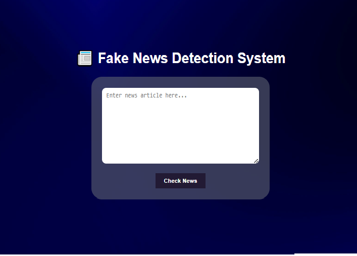
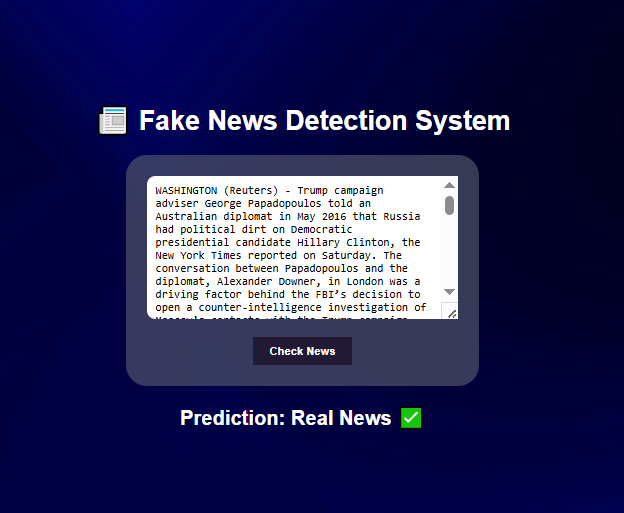

# Fake News Detection System

This project implements a machine learning-based system to detect fake news articles.  
It provides a user-friendly web interface to classify news as fake or true using trained models.

---

## Features

- Detects fake news using multiple ML models  
- Interactive Flask web application  
- Scripts included for dataset preprocessing and model training  
- Clear, visual feedback with prediction results  

---

## Project Structure

Fake-News-Detection-System/
│
├── app.py # Flask application script
├── train_model.py # Model training script
├── model/ # Trained machine learning models (.pkl files)
├── static/ # Static files (CSS, JavaScript, images)
│ ├── phote.png # background image
├── templates/ # HTML template files
├── README.md # Project documentation (this file)
└── requirements.txt # Python dependencies

---

## Sample Screenshots

### Main Page



### Prediction: Fake News


### Prediction: True News



---

## Getting Started

### Prerequisites

- Python 3.7 or higher  
- pip package manager  

### Installation and Running

1. Clone the repository:

   ```bash
   git clone https://github.com/Alishba-Haroon/Fake-News-Detection-System.git
   cd Fake-News-Detection-System
